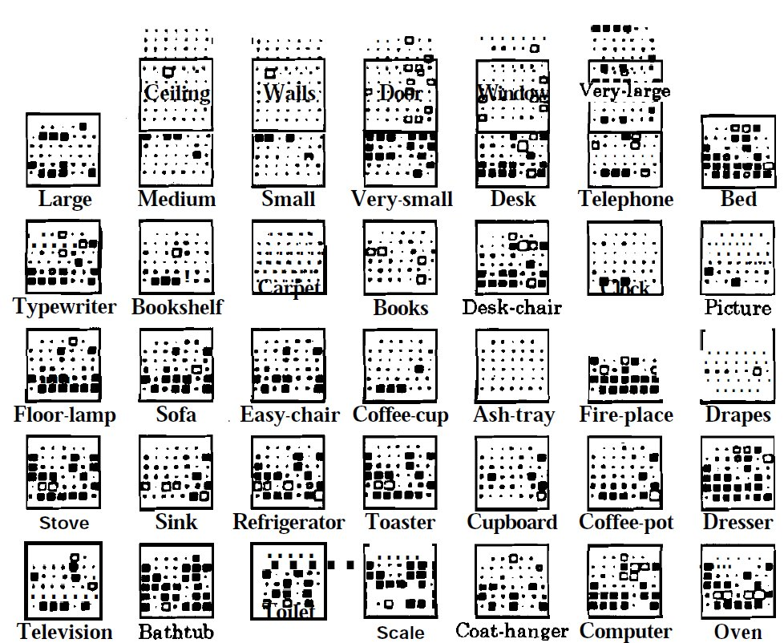
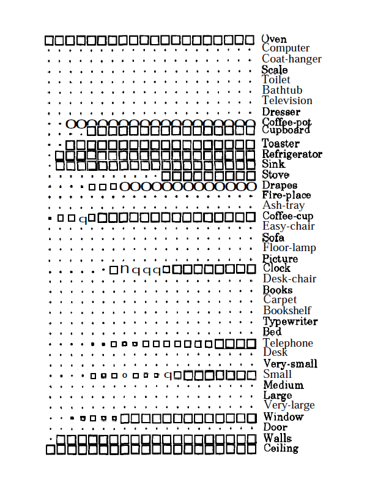
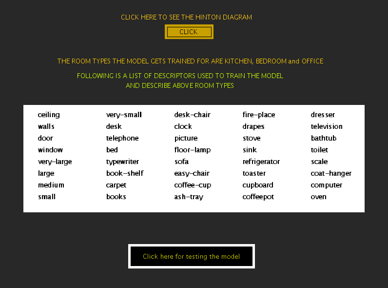
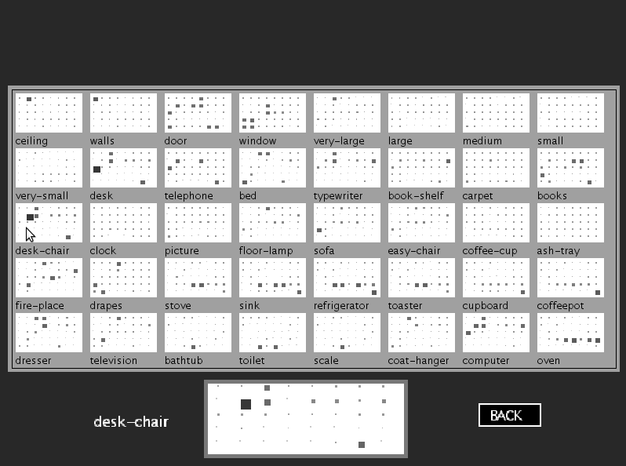
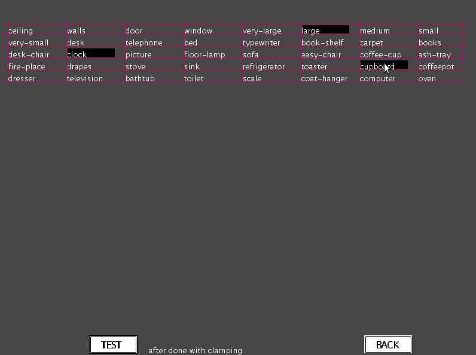
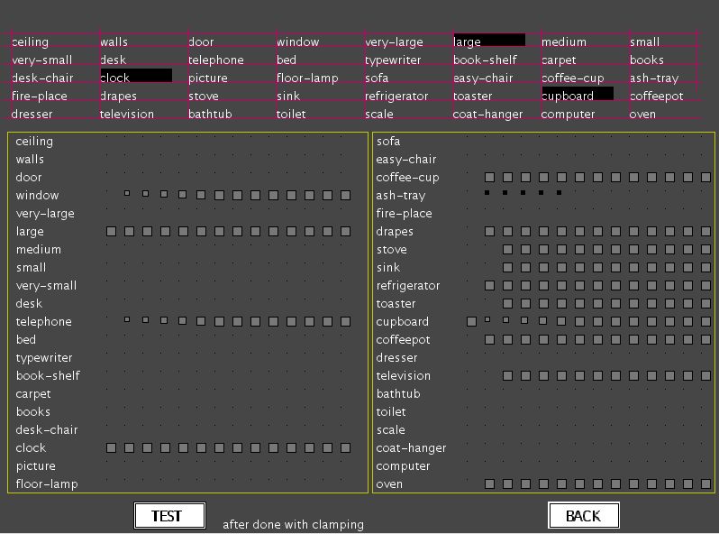

#### Example of recognition of handwritten characters

In an apparently simple task of recognition of handwritten characters, it is difficult to articulate precisely what we capture as features in the patterns of several samples of each character. But when we are presented with a new sample of a handwritten character, most of the time we have no difficulty in recognizing it correctly. It is likely that from the samples of a handwritten character we may have captured a large number of weak evidence of features in our memory, so that with a new sample as input, the memory relaxes to a state that satisfies as many constraints as possible to the maximum extent.

#### Constraint satisfaction model

The above idea of constraint satisfaction can be captured in a PDP model consisting of several units and connections among the units. In this model the units represent hypotheses and the connections represent the knowledge in the form of constraints between any two hypotheses. It is obvious that the knowledge cannot be precise and hence the representation of the knowledge in the form of constraints may not also be precise. So the solution being sought is to satisfy simultaneously as many constraints as possible. Note that the constraints usually are weak constraints, and hence all of them need not be satisfied fully as in the normal constrained optimization problems. The degree of satisfaction is evaluated using a goodness-of-fit function, defined in terms of the output values of the units as well as the weights on the connections between units.
The model we have is already trained and has weights assigned to it. It is these weights that aid in making the original hinton diagram. We can further train the network by providing our input on which descriptor best fits whch room and update the weights accordingly. These new weights are what aid in the making of the new Hinton Diagram.

The clamping of descriptors is like an external input given to the netowrk. When we do so and test the network, after a few cycles, we see the descriptors belonging to the room type of the descriptor that was clamped to be lit up whereas others are not.
Example of capturing the concept of the type of room from descriptors

The constraint satisfaction PDP model is illustrated here with an example of how our concepts of various types of rooms can be captured by the model from samples of description of these rooms. Let us assume that we collect data from subjects about their understanding of the following five types of rooms: Living room, kitchen, bedroom, office and bathroom. In order to elicit information from the subjects, 40 descriptors are provided to them, in terms of which each subject can be asked to give his/her view of the above room types. The descriptors are shown in the following figure

|Ceiling|Walls|Doors|Windows|Very-large|
|-------|-----|-----|-------|----------|
|Large|Medium|Small|Very-small|Desk|
|Telephone|bed|Typewriter|Book shelf|Carpet|
|Books|Desk-chair|Clock|Picture|Floor-lamp|
|Sofa|Easy-chair|Coffee-cup|Ashtray|Fireplace|
|Drapes|Stove|Coffeepot|Refrigerator|Toaster|
|Cup board|Sink|Dresser|Television|Bathtub|
|Toilet|Scale|Wen|Computer|Clothes-hanger|

**Figure 1**: *Table showing the descriptors used in the example.*

Each subject can be asked to mark which of these descriptors are valid for each room type. From the data collected from a number of subjects, the weights between units are computed. Here the units represent the descriptors. The output of a unit is binary, indicating whether the description is present or not. The connection weights between units are derived fiom the co-occurrence patterns of the descriptors in the responses of the subjects for all the room types. One method of deriving the weights is as follows:

$$ w_{ij} = -log\frac{P(x_i = 0 ~ and ~ x_j = 1) P(x_i = 1 ~ and ~ x_j = 0)}{P(x_i = 0 ~ and ~ x_j = 0)P(x_i = 1 ~ and ~ x_j = 1)} \qquad(1)$$

where \(w_{ij}\) represents the symmetric weight connecting the unit \(j\) and unit \(i\). The numerator represents the product of probabilities that the hypotheses of the units i and j are competing with each other, i.e., one unit has the value \(x_i\) = 1 and the other has the value \(x_j\) = 0. The denominator represents the product of probabilities that the hypotheses of units i and j support each other. Thus if the evidence is greater for supporting hypotheses, then the weight \(w_{ij}\) will be positive, otherwise it is negative. Note that the probabilities are replaced by the relative frequencies in the data. In addition, each unit can have a bias reflecting the prior information about the hypothesis the unit represents. In this case the bias is given by $$ b_i = -log\frac{P(x_i=0)}{P(x_i=1)} \qquad(2)$$

There can be direct evidence for a hypothesis through an external input. The corresponding input unit could be clamped indicating that the hypothesis is either always 'ON' or always 'OFF'. Other types of external input could be a graded one indicating a weak evidence.

A constraint satisfaction model can be displayed by means of a Hinton diagram as shown in the following figure. Each larger square in the figure represents a unit. There are 40 units corresponding to 40 descriptors. Within the square of each unit a replica of all the 40 units are displayed as dots, each dot representing the unit in its relative position in the diagram. Around each dot, a white square indicates a positive weight connecting the unit representing the dot and the unit enclosing the dot. Thus for example, the white square on the second dot in the unit for 'ceiling' indicates that the 'walls' unit is connected to the ceiling unit with a positive weight. The size of the white square indicates the strength of the positive connection. Likewise in the last unit corresponding to 'oven', the small dark square around the last but one dot indicates that the units 'oven' and 'computer' are connected with a negative weight. There are many units which have no connections at all.

**Figure 2**: *Hinton diagram for the 'rooms' example.*

The model is allowed to relax by computing the next state for each unit selected at random, computing sum of its weighted inputs and thresholding the weighted sum using a hard-limiting output function. For a given external evidence, say like 'oven' and 'ceiling' in the following figure, the state of the network after each cycle is shown in the figure. After 17 cycles the model settles down to an equilibrium state closest to the given external evidence, and the state description gives a description of the concept of the room satisfying the external evidence, namely 'kitchen', in this case. Thus the PDP model clearly demonstrates the concepts of rooms captured by the weak constraints derived from the data given by the subjects. The model captures the concepts of the five room types at the equilibrium states corresponding to the description that best fits each room type. A goodness-of-fit function (g) is defined for each state (\(x_1,x_2, ...,x_N)\) , where \(x_i\) = 1 or 0, as $$ g = \sum\limits_{i,j=1}^{N}w_{ij} x_i x_j + \sum\limits_{i=1}^{N} e_i x_i + \sum\limits_{i=1}^{N} b_i x_i \qquad(3)$$

where \(e_i\) is the external input given as output of the \(i^{th}\) unit and \(b_i\) is the bias of the unit \(i\). At each of the equilibrium states the goodness-of-fit function is maximum. The model not only captures the concepts of the room types, but it also gives an idea of their relative separation in the 40 dimensional space.

#### FORMULAE USED

if descriptor is clamped, it is given activation 1, otherwise 0.
nextState[i] of a descriptor is the sum of the products of activation[j] with weights[i][j]
if nextState[i] is greater than the threshold, it is given value 1, otherwise 0.
if nextState[i] is 1, activation is set to 1 irrespective of it's initial value.
activation of each descriptor is calculated for 16 cycles one after another and displayed.

For further information, refer the references given in the references section for this experiment.

**Figure 3**: *The state of the CS model after each cycle, starting with an initial state where the units 'ceiling' and 'oven' are clamped.*

### Illustration of Constraint Satisfaction Model

In this experiment, we use the PDP model called the Constraint Satisfaction Model, to illustrate how we as humans, attempt building of concepts as well as to arrive at conclusions given weak evidences. We start with a set of 40 descriptors used to characterize different room types. These descriptors can also be referred as hypotheses . Also present with the model is the relationship between these descriptors, acting as constraints, which can either be weak or strong. So eventually given a set of such hypotheses and weak or strong constraints between these, we arrive at some knowledge towards a particular room type in this example. The experiment first shows all the 40 descriptors involved in capturing knowledge for a given room type.

**Figure 1**: *Experiment window showing descriptors and other buttons.*

The constraint satisfaction model which is illustrated in this experiment is already trained. We can view the model using Hinton Diagram by clicking on the "CLICK" button on top. A new panel showing the Hinton Diagram for all the descriptors appears where 40 hypotheses have their corresponding squares with constraints between them and other hypotheses being displayed within the larger square. Moving the mouse over the squares presents their zoomed picture at the bottom of the page.

**Figure 2**: *Experiment panel showing the Hinton diagram for the descriptors.*

In the above diagram we notice that each large square represents a unit. There are 40 units corresponding to 40 descriptors. Within the square of each unit a replica of all the 40 units are displayed as smaller squares or dots, each dot representing the unit in its relative position in the diagram. Around each dot, weak constraints are depicted by smaller squares in lighter gray shade. Similarly strong constraints is represented by darker gray or black color with a square of larger size. There are many units which have no connections at all.

The constraint satisfaction model is used to illustrate the ability of human beings to build concepts or arrive at conclusion based on partial and sometime erroneous knowledge. The key idea of the model is that a large number of weak constraints when put together, evolve into a definitive conclusion. To test the model, some units can be clamped or say provided a constant external bias. As shown in the figure below, we can click on the units and have these clamped.

**Figure 3**: *Testing of the model by clamping some units.*

After clamping the model is allowed to relax by computing the next state for each unit selected at random. The state computation is done by computing sum of the weighted inputs and thresholding the weighted sum using hard-limiting output function. After we click the test network button, we find that after running through some iterations the network settles to a state where no further change in the state of descriptors is visible. And then the state description gives the description of the concept of the room satisfying the external evidence or clamping

**Figure 4**: *Figure showing the states of descriptors after reaching equilibrium.*